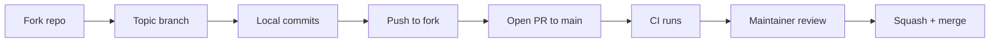

# Contributing to CheckOwners

Thanks for thinking about contributing. CheckOwners is a pure-git ownership inference engine; this guide covers the local workflow, the conventions enforced by CI, and the PR process.

## Quick start

```bash
git clone https://github.com/smusali/checkowners.git
cd checkowners
pip install hatch
hatch run test
```

`hatch run test` builds the env (including `[graph]` and `[github]` via the `dev` extra), runs the suite with coverage, fails if total coverage is below 85%, and prints a branch-coverage report for `patterns.py`, `analyze.py`, `drift.py`, and `generate.py`. Everything else (lint, format, build) flows through the same environment.

Without hatch:

```bash
python -m venv .venv
source .venv/bin/activate
pip install -e ".[dev]"
pytest
```

## Common commands

| Command | What it does |
|---------|--------------|
| `hatch run test` | pytest with coverage; CI fails below 85% |
| `hatch run test -- tests/test_analyze.py --no-cov` | run a single test file without the coverage floor |
| `hatch run test -- -k "test_name" --no-cov` | run tests matching a substring without the coverage floor |
| `hatch run lint` | ruff check (including S and PTH) + mypy `--strict` |
| `hatch run fmt` | ruff format |
| `hatch build` | produce sdist and wheel in `dist/` |

CI installs from `requirements-dev.lock` with hashes, then runs pytest across Python 3.11, 3.12, 3.13, and 3.14, builds the wheel, smoke-tests CLI subcommands against the built artifact (including `checkowners[all]` and `py.typed`), and runs ruff plus mypy `--strict`. Match those locally before opening a PR.

Optionally, install the pre-commit hooks so ruff, formatting, and mypy run on every commit:

```bash
pip install pre-commit
pre-commit install
```

## Branch and PR workflow



1. Fork the repo and create a branch named after the change (`feat/topology-overlap`, `fix/validate-inline-comments`).
2. Keep commits focused; one conventional commit per logical step. Squash-and-merge is the default, so commit history inside the branch can be granular without polluting `main`.
3. Open the PR against `main`. The PR description should state the user-visible behavior change, link to any related issue, and call out follow-up work that is intentionally out of scope.
4. Wait for CI; fix anything red. Maintainers review once CI is green.

## Conventional commits

Every commit on `main` follows the [Conventional Commits](https://www.conventionalcommits.org/) spec so the changelog can be generated mechanically:

- `feat(<scope>): <subject>` for user-visible additions
- `fix(<scope>): <subject>` for bug fixes
- `docs(<scope>): <subject>` for documentation
- `chore(<scope>): <subject>` for tooling / metadata
- `ci(<scope>): <subject>` for workflow changes
- `test(<scope>): <subject>` for test-only changes

Scopes match module names (`analyze`, `drift`, `cli`, etc.) or umbrella areas (`docs`, `ci`, `security`). The commit body explains the *why* and the body lines stay wrapped at 80 columns or so.

## Code conventions

- Python 3.11 minimum through 3.14. Use modern syntax (`X | Y` unions, `dict[str, int]`). Python 3.10 is not supported: it reaches upstream end of life in October 2026, and chasing it would only complicate the runtime. The Action installs its own interpreter. Older system Pythons are better served by standalone artifacts than by widening `requires-python`.
- Functional style. The only classes allowed are dataclasses in `models.py` and small frozen dataclasses living inside the module that returns them.
- Type hints on **every** function signature; `mypy --strict` is enforced.
- All paths via `pathlib.Path`; never hardcode strings. Ruff `PTH` enforces this.
- New CLI subcommand? Wire it in `cli.py`, give it a `--json` mode, and persist results through `state.write_state` when appropriate.
- Ownership is never binary: every owner carries a confidence score, clamped to `[0.0, 1.0]`.

## Tests

- Every module has a `tests/test_<module>.py`.
- Unit tests mock all subprocess calls (`git log`, `git blame`); they must not require a real git repo.
- Tests that touch `~/.checkowners/state.json` set the `CHECKOWNERS_STATE_DIR` env var so they don't clobber the contributor's real state.
- Coverage is enforced at 85% repo-wide (`--cov-fail-under=85`); new modules should land above that. The floor is a gate, not a substitute for tests against real git repositories and real CODEOWNERS files. For a focused run that should not apply the floor, pass `--no-cov`.

## Dependencies

Runtime dependencies are capped at the next untested major (`typer>=0.9.0,<1`, `rich>=13.0.0,<16`, and so on). Bump a ceiling when CI proves the new major. CI installs third-party test and lint deps from `requirements-dev.lock` with hashes. The composite Action installs runtime extras from `requirements.lock` with hashes.

## Coverage uploads

CI uploads `coverage.xml` to Codecov with the `CODECOV_TOKEN` repository secret. Install the [Codecov GitHub App](https://github.com/apps/codecov) on the account for PR comments and status checks. If the README badge still 500s after a green upload on `main` (typical leftover state after an organization move), erase the project in Codecov's Danger Zone and let the next CI run recreate it.

## Reporting bugs

Open an issue at <https://github.com/smusali/checkowners/issues> with:

1. The command you ran and the `--json` output if available.
2. The relevant `.github/checkowners.yml` (redact tokens; we don't accept them in this file anyway).
3. Repo characteristics that matter (contributor count, lookback window, whether `github.api_enabled` is on).
4. Expected behavior vs. observed behavior.

## Security issues

Do not open public issues for vulnerabilities. Email <fortyone.technologies@gmail.com> with a description and a proof-of-concept. We will respond and coordinate disclosure.

## Releasing

Tagged releases trigger `.github/workflows/publish.yml` which builds and uploads to PyPI via Trusted Publisher.

Append user-visible notes under `[Unreleased]` in [docs/CHANGELOG.md](CHANGELOG.md) as they merge. Each dated heading is the UTC calendar day the GitHub Release will be published (that event uploads to PyPI), formatted `YYYY-MM-DD`. `Unreleased` has no date. If publish slips to another UTC day, update the heading before creating the Release.

`python tools/check_changelog.py vX.Y.Z` must succeed before tagging. The publish job runs the same check and fails the upload if the heading is missing, has no date, or the Action pin / wheel / lockfiles disagree with the tag.

Steps:

1. Bump `__version__` in `checkowners/__init__.py` (hatch reads it for the package version).
2. Set the Action pin to the same version: `checkowners_version` default and `CHECKOWNERS_PINNED_VERSION` in `action.yml`.
3. Rebuild the Action wheel (`hatch build`) and replace `checkowners-X.Y.Z-py3-none-any.whl` at the repository root. Remove the previous version's wheel.
4. Regenerate the hashed lockfiles:
   `pip-compile --generate-hashes --extra graph --extra github -o requirements.lock pyproject.toml`
   and
   `pip-compile --generate-hashes --extra graph --extra github --extra dev --unsafe-package checkowners -o requirements-dev.lock pyproject.toml`.
5. Promote `[Unreleased]` to `## [X.Y.Z] - YYYY-MM-DD`, leave a fresh `[Unreleased]`, and refresh the compare links at the bottom of the changelog.
6. Confirm `python tools/check_changelog.py vX.Y.Z` succeeds.
7. Tag the commit: `git tag -a v0.X.Y -m "v0.X.Y"` and push the tag.
8. Create a GitHub Release pointing at the tag; the publish workflow takes it from there.
