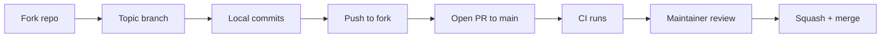

# Contributing to CheckOwners

Thanks for thinking about contributing. CheckOwners is a pure-git ownership inference engine; this guide covers the local workflow, the conventions enforced by CI, and the PR process.

## Picking work

Start from a [good first issue](https://github.com/smusali/checkowners/issues?q=is%3Aissue+is%3Aopen+label%3A%22good+first+issue%22) or the [public roadmap](https://github.com/smusali/checkowners/blob/main/ROADMAP.md). The [action-item register](ACTION_ITEMS.md) lists every planned change and its issue.

Usage questions go to [Discussions](https://github.com/smusali/checkowners/discussions/categories/q-a). The issue tracker is for bugs, false positives, and features; those forms are required.

## Quick start

```bash
git clone https://github.com/smusali/checkowners.git
cd checkowners
pip install hatch
hatch run test
```

`hatch run test` builds the env (including `[graph]` and `[github]` via the `dev` extra), runs the suite with coverage, fails if total coverage is below 85%, and prints a branch-coverage report for `patterns.py`, `analyze.py`, `drift.py`, and `generate.py`. Everything else (lint, format, build) flows through the same environment.

Without hatch:

```bash
python -m venv .venv
source .venv/bin/activate
pip install -e ".[dev]"
pytest
```

## Common commands

| Command | What it does |
|---------|--------------|
| `hatch run test` | pytest with coverage; CI fails below 85% |
| `hatch run test -- tests/test_analyze.py --no-cov` | run a single test file without the coverage floor |
| `hatch run test -- -k "test_name" --no-cov` | run tests matching a substring without the coverage floor |
| `hatch run lint` | ruff check (including S and PTH) + mypy `--strict` |
| `hatch run fmt` | ruff format |
| `hatch build` | produce sdist and wheel in `dist/` |

CI installs from `requirements-dev.lock` with hashes, then runs pytest across Python 3.11, 3.12, 3.13, and 3.14, builds the wheel, smoke-tests CLI subcommands against the built artifact (including `checkowners[all]` and `py.typed`), and runs ruff plus mypy `--strict`. Match those locally before opening a PR.

Optionally, install the pre-commit hooks so ruff, formatting, and mypy run on every commit. This repository also runs `checkowners validate` when a CODEOWNERS file changes, and `checkowners drift` on push against `.checkowners-baseline.json`.

```bash
pip install pre-commit
pre-commit install
```

`pre-commit install` registers both the commit hook and the push hook (`default_install_hook_types`). Re-run it after pulling this change if the hooks were already installed. `checkowners` must be on `PATH` for those two hooks.

## Branch and PR workflow



1. Fork the repo and create a branch named after the change (`feat/topology-overlap`, `fix/validate-inline-comments`).
2. Keep commits focused; one conventional commit per logical step. Squash-and-merge is the default, so commit history inside the branch can be granular without polluting `main`.
3. Open the PR against `main`. The PR description should state the user-visible behavior change, link to any related issue, and call out follow-up work that is intentionally out of scope.
4. Wait for CI; fix anything red. Maintainers review once CI is green.

## Conventional commits

Every commit on `main` follows the [Conventional Commits](https://www.conventionalcommits.org/) spec so the changelog can be generated mechanically:

- `feat(<scope>): <subject>` for user-visible additions
- `fix(<scope>): <subject>` for bug fixes
- `docs(<scope>): <subject>` for documentation
- `chore(<scope>): <subject>` for tooling / metadata
- `ci(<scope>): <subject>` for workflow changes
- `test(<scope>): <subject>` for test-only changes

Scopes match module names (`analyze`, `drift`, `cli`, etc.) or umbrella areas (`docs`, `ci`, `security`). The commit body explains the *why* and the body lines stay wrapped at 80 columns or so.

## Code conventions

- Python 3.11 minimum through 3.14. Git 2.23 or newer is required at runtime (`ignore-revs` support). Use modern syntax (`X | Y` unions, `dict[str, int]`).
- Python 3.10 is not supported. It reaches upstream end of life in October 2026, and chasing it would only complicate the runtime. The Action installs its own interpreter. Older system Pythons are better served by standalone artifacts than by widening `requires-python`.
- Functional style. The only classes allowed are dataclasses in `models.py` and small frozen dataclasses living inside the module that returns them.
- Type hints on **every** function signature; `mypy --strict` is enforced.
- All paths via `pathlib.Path`; never hardcode strings. Ruff `PTH` enforces this.
- New CLI subcommand? Wire it in `cli.py`, give it a `--json` mode, and persist results through `state.write_state` when appropriate.
- Ownership is never binary: every owner carries an `ownership_score` in `[0.0, 1.0]` plus a separate `evidence_quality`.

## Tests

- Every module has a `tests/test_<module>.py`.
- Unit tests mock subprocess calls such as `git log` and `git blame`. They do not need a git binary.
- Integration tests build a temporary repository with the `git_repo` fixture in `tests/conftest.py`. Commits pin `GIT_AUTHOR_DATE` and `GIT_COMMITTER_DATE`. Mark them `@pytest.mark.integration`.
- Drift, patterns, generate, and validate keep both layers: mocked unit tests, and integration tests against a real git history and real CODEOWNERS text.
- `pytest -m integration` selects the integration tests. `pytest -m "not integration"` skips them. The default `pytest` run includes them, including on every pull request.
- The integration marker must finish within 60 seconds.
- `tests/test_golden.py` is the ownership judgment suite. Histories pin author and committer dates, and analysis uses a fixed as-of. Expected conclusions are keyed by `OWNERSHIP_MODEL_VERSION`. A model-version change updates that record in the same commit. The beliefs are written in `docs/METHODOLOGY.md`.
- Blame-fidelity tests may keep calling `init_git_repo` and `git_commit`.
- Git 2.23 or newer is required. The fixture fails if `git version` is older.
- Tests that touch `~/.checkowners/state.json` set the `CHECKOWNERS_STATE_DIR` env var so they don't clobber the contributor's real state.
- Coverage is enforced at 85% repo-wide (`--cov-fail-under=85`); new modules should land above that. The floor is a gate, not a substitute for tests against real git repositories and real CODEOWNERS files. For a focused run that should not apply the floor, pass `--no-cov`.
- `checkowners/patterns.py` also fails CI below 100% branch coverage. The cases live in `corpus/compatibility.jsonl` (pattern, path, and whole-file rules) and `corpus/realworld.jsonl` (parser fixtures from permissively licensed public repositories). `corpus/README.md` is the format other tools can load.
- Property and differential tests use Hypothesis. `HYPOTHESIS_PROFILE=ci` (the default) runs 200 examples. `HYPOTHESIS_PROFILE=nightly` runs 10,000.
- The nightly Fuzz workflow runs that profile, then mutation-tests `patterns.py` and fails if the killed-mutant score is below 90. A shrunk failure is a JSON object with `kind`, `category`, `pattern`, `path`, and `expected`. Append it to `corpus/compatibility.jsonl` and fix the matcher. Do not commit a bot-generated file.

## Dependencies

Runtime dependencies are capped at the next untested major (`typer>=0.9.0,<1`, `rich>=13.0.0,<16`, and so on). Bump a ceiling when CI proves the new major. CI installs third-party test and lint deps from `requirements-dev.lock` with hashes across Python 3.11–3.14, so interpreter-specific pins (today `pyyaml-ft`) must keep environment markers. The composite Action installs runtime extras from `requirements.lock` with hashes.

## Coverage uploads

CI uploads `coverage.xml` to Codecov with the `CODECOV_TOKEN` repository secret. Install the [Codecov GitHub App](https://github.com/apps/codecov) on the account for PR comments and status checks. If the README badge still 500s after a green upload on `main` (typical leftover state after an organization move), erase the project in Codecov's Danger Zone and let the next CI run recreate it.

## Reporting bugs

Open an issue from the [issue chooser](https://github.com/smusali/checkowners/issues/new/choose). Use the bug form for a defect, the false-positive form when inference named the wrong owner, and the feature form for a proposed change. Each form asks for the command, configuration (no tokens), repository shape, and merge strategy.

Usage questions belong in [Discussions](https://github.com/smusali/checkowners/discussions/categories/q-a), not the issue tracker.

## Security issues

Do not open public issues for vulnerabilities. Use [private vulnerability reporting](https://github.com/smusali/checkowners/security/advisories/new). You can also email <fortyone.technologies@gmail.com> with a description and a proof-of-concept. We will respond and coordinate disclosure.

## Breaking changes

A breaking change is any of:

- CLI command removal
- JSON schema changes
- scoring-model changes
- default policy changes
- Action input or output changes
- configuration schema changes

`0.x` may include those changes in a minor release when the changelog calls them out. `1.x` keeps those contracts stable until a major release.

Scoring, risk classification, and topology each have a model id (`model.ownership`, `model.risk`, `model.topology`). Changing the algorithm bumps that id. Configuration files may pin the ids this release implements; an unknown pin is refused. Cached analyze state and the graph cache are reused only when those ids match.

Append user-visible notes under `[Unreleased]` in [docs/CHANGELOG.md](CHANGELOG.md) as they merge. Leave `[Unreleased]` non-empty. A pointer to [ROADMAP.md](../ROADMAP.md) is enough when nothing has landed yet.
