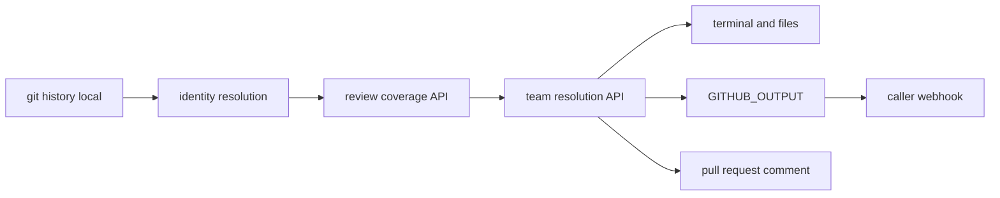

# Privacy

This is a knowledge-risk tool, not a performance-measurement tool. Using it for individual evaluation is unsupported and harmful.

checkOwners reads git history on the machine where it runs and writes an ownership map. Email addresses are stored as tokens. When identity lookup is enabled, an address that is not already resolved may be sent to the GitHub user-search API. `contributors.exclude` keeps those people out of that lookup.

`output.anonymize`, `output.aggregate_only`, `privacy.redact_emails` (`--redact-emails`), `identity.mode`, and `contributors.exclude` control what reports may show. See [Privacy controls](USAGE.md#privacy-controls).

## What is read

All of this stays on the machine that runs the command:

- `git log` and `git blame` (history and line attribution, not a copy of the source tree)
- `.mailmap`, `.git-blame-ignore-revs`, and `.gitattributes`
- the CODEOWNERS file, if one exists
- `.github/checkowners.yml`

Source file contents are not uploaded. The cache key is the normalized `origin` URL, or the absolute checkout path when the repo has no `origin`.

## What leaves the machine

With `--offline`, with no `GITHUB_TOKEN`, or without the `github` extra, nothing does. The command prints:

```text
Network access: disabled
Review evidence: unavailable
Team verification: unavailable
```

Otherwise a token can be used for the calls below. Each one runs only when its gate is on, the token is set, and the `github` extra is installed. `--offline` skips all of them. Noreply addresses, `.mailmap`, and an existing handle file still resolve locally.

| When | Call | Sent |
| --- | --- | --- |
| `github.resolve_handles` is true (the default), and an address is not a noreply email, not in `contributors.exclude`, and not already in `handles.json` (including a remembered miss) | `GET /rate_limit`, then `GET /search/users` with query `{email} in:email` | The address is the search query |
| `github.api_enabled` is true and `GITHUB_REPOSITORY` is set. Review collection also resolves handles, so the search row above can run first | `GET /rate_limit`, `GET /repos/{owner}/{repo}`, `GET /repos/{owner}/{repo}/pulls` (closed, newest update first, at most 200), then `GET /repos/{owner}/{repo}/pulls/{n}/reviews` and `GET /repos/{owner}/{repo}/pulls/{n}/files` | Repository name. Responses are reviewer logins and changed paths |
| `generate` or `sync` with `github.resolve_teams` and `github.org`, or topology and explain when `github.api_enabled` and `github.org` are set | `GET /orgs/{org}`, `GET /orgs/{org}/teams`, `GET /orgs/{org}/teams/{slug}/members` | Organization name. Responses are team slugs and member logins |
| Composite Action, `comment_on_pr` true, same-repo pull request | `GET /repos/{owner}/{repo}/issues/{n}/comments`, then `POST` a new comment or `PATCH` the existing one | The report markdown |

A workflow that posts `GITHUB_OUTPUT` to a webhook does that itself. checkOwners does not open that connection. See [Data flow](#data-flow).

## What is stored

| Location | Contents |
| --- | --- |
| `~/.checkowners/state/<id>.json` | Inferred owners, commits, and the analyzed commit. Email addresses are `email:` tokens: `email:` plus the first 16 hex characters of SHA-256 over the lowercased address. |
| `~/.checkowners/graph/<id>.json` | Serialized ownership graph for that analysis. Contributor emails in node ids are the same tokens. |
| `~/.checkowners/handles.json` | Email token to GitHub `@handle`, including remembered misses (an empty string). A file that still has plaintext addresses is rewritten on the next read. `@handles` are stored as themselves. |

`checkowners cache path` prints the directory. `CHECKOWNERS_STATE_DIR` overrides it. The composite Action sets that variable to `${{ runner.temp }}/checkowners-state`. Files are local. Analysis does not upload them.

The cache holds hashed emails and `@handles`. It does not hold raw addresses after the next read. Those identities are still personal data.

## Deleting it

`checkowners cache clear` removes analysis state and graph files and leaves `handles.json` in place.

`checkowners cache purge` removes every file under the cache directory, including contributor identities in `handles.json`. That is how you delete this data. The cache directory itself is kept.

## Disable identity lookup

Set `github.resolve_handles: false`, or pass `--offline`. Noreply parsing and `.mailmap` still run locally when mailmap is enabled. `--offline` also skips review coverage and team verification.

## Redact emails

Set `privacy.redact_emails: true`, or pass `--redact-emails`. Addresses in output are replaced with `email:` tokens. The other presentation controls are in [Privacy controls](USAGE.md#privacy-controls).

## Retention

There is no time-to-live.

State and graph files are dropped oldest-first once they exceed 256 MiB together. `handles.json` is not part of that eviction. It stays until `cache purge`, or until you delete the cache directory.

`--max-age SECONDS` refuses to reuse an analysis older than that. It does not delete the file. `0` expires immediately for reuse. Omit the flag for no age limit.

A job that uses the Action's runner temp directory loses the cache when the runner is discarded. CLI and hand-rolled CI keep `~/.checkowners/` until you purge it, unless you point `CHECKOWNERS_STATE_DIR` at an ephemeral path.

## Data flow



Identity resolution is local first: `.mailmap`, then GitHub noreply addresses, then `handles.json`, then the user-search API. Review coverage and team resolution are API steps and run only under the gates in [What leaves the machine](#what-leaves-the-machine). Outputs are the terminal, local report files, `GITHUB_OUTPUT`, and the pull-request comment. A webhook is optional and is posted by the caller's workflow from `GITHUB_OUTPUT`, not by checkOwners.

## Threat model

**What source data is read?** Git history, blame, mailmap, ignore-revs, gitattributes, CODEOWNERS, and `.github/checkowners.yml`. Source file contents are not uploaded.

**What leaves the machine?** Nothing under `--offline`, with no token, or without the `github` extra. Otherwise the calls in [What leaves the machine](#what-leaves-the-machine): an unresolved email on user search, repository and pull-request metadata for review coverage, organization and team membership for team resolution, and the report body when the Action comments.

**When is GitHub contacted?** Only when a gate above is on, `GITHUB_TOKEN` is set, and the `github` extra is installed. Local noreply parsing, mailmap, and cache hits do not contact GitHub.

**What is cached?** The ownership map, the ownership graph, and the handle map, under `~/.checkowners/` or `CHECKOWNERS_STATE_DIR`.

**Does the cache contain sensitive identities?** Yes. Emails are `email:` tokens, not raw addresses. `@handles` are stored in full. Treat the directory as personal data.

**Where is it stored?** On the machine that ran the command. The Action uses the runner temp directory. Do not commit the cache. This repo's `.gitignore` ignores `.checkowners/`.

**How are tokens handled?** The only supported token source is the `GITHUB_TOKEN` environment variable. `github.token` in config is rejected because that file is committed. See [SECURITY.md](../SECURITY.md).

**What permissions are required?** [What token scopes are needed](FAQ.md#what-token-scopes-are-needed).
