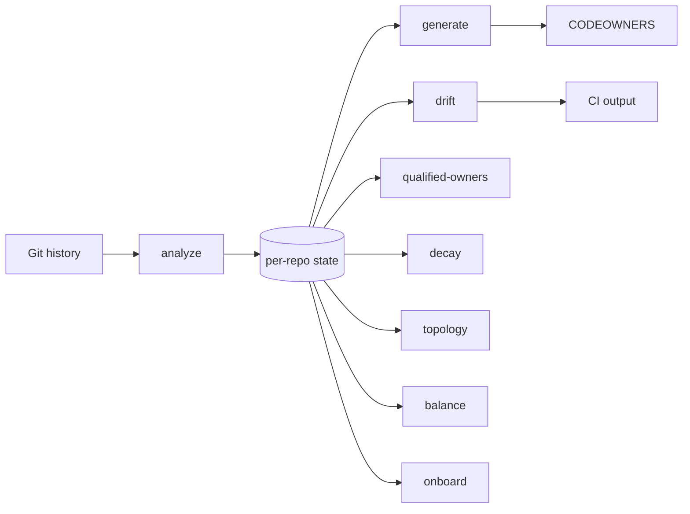
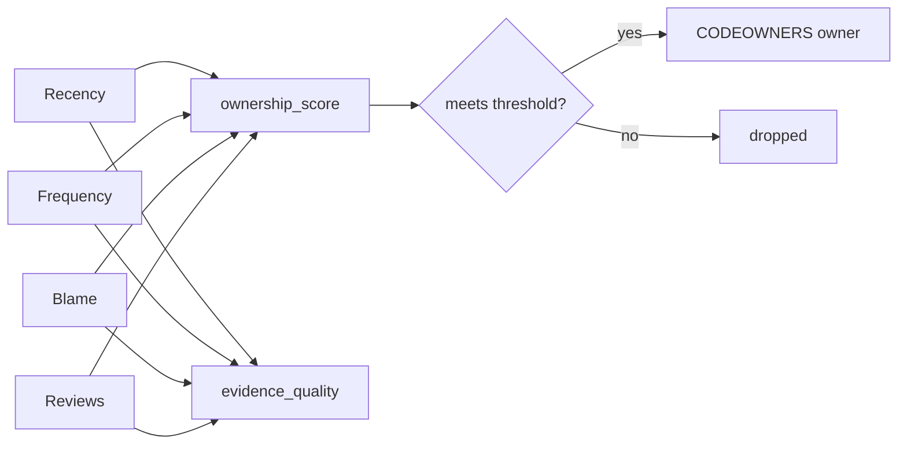

# Usage

Full configuration, scoring, and CI reference. For a quick command list see the [README](../README.md). For answers to common questions see [docs/FAQ.md](FAQ.md).

## Pipeline



State is cached per repo at `~/.checkowners/state/<repo-hash>.json` (override the base directory with `CHECKOWNERS_STATE_DIR`). `trends` is independent of the cached state: it runs its own `git log` pass to reconstruct per-period snapshots. `explain` and `owners` (`who`) also skip the cache: they analyze only the requested file or directory and do not write state.

## Configuration

Create `.github/checkowners.yml`. Every field is optional; defaults shown. `version: 2` is the current schema. A file with no `version`, or `version: 1`, still loads for one minor cycle after `0.6.0` and warns when it uses a key that moved. Any other `version` is refused.

The numbers below are the runtime defaults. Longer-term proposals (adaptive lookback, `max_owners: 5`, different signal weights, truck-factor thresholds) are not applied here.

```yaml
version: 2

analysis:
  lookback_days: 365          # integer days; adaptive lookback is not accepted
  max_owners: 3               # was analysis.top_n_owners
  confidence_threshold: 0.3   # owners below this are dropped from CODEOWNERS
  respect_gitattributes: true # linguist-generated / linguist-vendored exclude paths first

qualification:
  strategy: adaptive          # adaptive | threshold (legacy, one cycle)
  min_commits: 1              # was analysis.min_commits; this key wins if both are set
  strong_blame_override: 0.5  # adaptive: keep authors at or above this blame share

model:
  ownership: ownership-v3     # pin must match this release, or be omitted
  risk: risk-v1
  topology: topology-v1
  signals:
    recency:
      weight: 0.35
      half_life_days: 90      # was scoring.recency_half_life_days
      reliability: 1.0
    frequency:
      weight: 0.25
      reliability: 1.0
    blame:
      weight: 0.25
      reliability: 1.0
    reviews:
      weight: 0.15           # skipped (not zeroed) when github.api_enabled is false
      reliability: 1.0

bots:
  exclude: true               # was analysis.exclude_bots; drop dependabot[bot] and similar

decay:
  threshold_days: 180         # flag owners idle longer than this
  alert_on_decay: true

bus_factor:
  critical_threshold: 1
  warn_threshold: 2

paths:
  exclude:
    - "*.lock"               # fallback when gitattributes do not mark the path
    - "package-lock.json"
    - "pnpm-lock.yaml"
    - "dist/**"
    - "vendor/**"
    - "node_modules/**"
    - "*.generated.*"
    - "*.min.js"
    - "*.min.css"
    - "*.map"
    - "*.whl"
    - ".github/CODEOWNERS"   # the generated file itself is never inferred
    - "CODEOWNERS"
    - "docs/CODEOWNERS"

output:
  header: "# Generated by checkOwners. Do not edit manually."
  include_unowned: false
  include_confidence: false   # if true, append "# alice(0.92) bob(0.71)" to each line
  consolidate: true           # collapse uniform directories into one dir/ rule
  max_bytes: 2500000          # refuse to write above this without --force (GitHub ignores files over 3 MB)
  verify_round_trip: true     # re-resolve every generated path; fail on mismatch
  allow_broad_patterns: false # emit * wildcards even when they cover extra paths with different owners

drift:
  mode: commit                # commit | repo | both
  min_confidence_delta: 0.2   # suppress small-delta drift
  hysteresis_runs: 1          # severity flips on first observation; raise to require N runs
  baseline_file: ""           # accepted-findings file; fail only on new findings

suppressions: []              # explicit, reason-required; see the adoption guide

notifications:
  webhook_url: ""             # literal, or ${ENV_VAR} to read from the environment
  include_unchanged: false    # if true, also notify when no drift was detected
  severity_threshold: medium  # low | medium | high | critical

github:
  org: ""
  resolve_handles: true       # noreply emails parse locally; others via search API
  resolve_teams: true         # collapse owner sets to a @org/team when possible
  api_enabled: false          # gate review_weight + topology/balance API features

git:
  blame_ignore_revs_file: .git-blame-ignore-revs
  detect_moves: true          # pass -M and -C to git blame
  mass_refactor_file_fraction: 0.5  # 0 disables; commits that modify this share of tracked files are omitted from blame
  use_mailmap: true           # alias of identity.mailmap

identity:
  mailmap: true               # apply .mailmap in git log and git blame (default; cheapest identity fix)
```

`decay`, `bus_factor`, `paths`, `output`, `drift`, `notifications`, `github`, `git`, `identity.mailmap`, and `suppressions` keep their current names on both schema versions. `bus_factor` is the qualified-owner classifier (`risk-v1`), not a truck-factor block.

Keys with no implementation yet are refused on `version: 2`, including `criticality`, `security`, `policy`, `privacy`, `risk`, `analysis.lookback_days: adaptive`, `model.signals.historical_depth`, `git.count_co_authors`, `git.merge_strategy`, and `output.anonymize`. A v1 file still ignores unknown keys.

| v1 key | v2 key |
| --- | --- |
| `analysis.top_n_owners` | `analysis.max_owners` |
| `analysis.min_commits` | `qualification.min_commits` |
| `analysis.exclude_bots` | `bots.exclude` |
| `scoring.recency_weight` | `model.signals.recency.weight` |
| `scoring.frequency_weight` | `model.signals.frequency.weight` |
| `scoring.blame_weight` | `model.signals.blame.weight` |
| `scoring.review_weight` | `model.signals.reviews.weight` |
| `scoring.recency_half_life_days` | `model.signals.recency.half_life_days` |
| `scoring.*_reliability` | `model.signals.*.reliability` |

JSON from every command includes `models` with `ownership`, `risk`, and `topology`. Analyze, explain, and owners JSON also keep `model_version` equal to the ownership id for one minor cycle. Human reports print the applicable ids on stderr. Per-repo analyze state and the graph cache are reused only when all three ids match; a file without `models` is ignored.

The GitHub token is **never** read from this file. Set the `GITHUB_TOKEN` environment variable instead. `checkowners.yml` is committed to your repo, so storing a token here would push it to GitHub. `load_config` raises a clear error if `github.token` is present. For the same reason, `notifications.webhook_url` supports a `${ENV_VAR}` reference (for example `${CHECKOWNERS_WEBHOOK_URL}`) so a committed config can point at a secret endpoint without storing it; an unset variable resolves to an empty string.

### Environment variables

| Variable | Who sets it | Role | Precedence |
|----------|-------------|------|------------|
| `CHECKOWNERS_CONFIG` | Action `config` input, or the user | Config file path (relative to repo root, or absolute) | Wins over `.github/checkowners.yml` |
| `CHECKOWNERS_DRIFT_MODE` | Action `mode` input, or the user | `commit` / `repo` / `both` | Applied after YAML load; wins over `drift.mode` |
| `CHECKOWNERS_BASELINE` | Action `baseline` input, or the user | Accepted-findings file path | Applied after YAML load; wins over `drift.baseline_file` |
| `CHECKOWNERS_STATE_DIR` | Action, or the user | State / handle / graph cache root | Wins over `~/.checkowners` |
| `GITHUB_TOKEN` | Action `github_token` input, or the user | Only supported token source | Never read from YAML (`github.token` is rejected) |
| `GITHUB_REPOSITORY` | GitHub runner | `owner/repo` for review coverage, topology, balance | Required for those API features; ignored otherwise |
| `GITHUB_OUTPUT` | GitHub runner | `github-action` writes bounded `schema_version: 2` summaries when set | Full `drift.json` / `bus_factor.json` / `decay.json` payloads are the uploaded artifact; summaries stay under the 1 MB per-output cap |
| `SOURCE_DATE_EPOCH` | User or CI | Integer POSIX seconds used as the analysis instant when `--as-of` is omitted | After `--as-of`; before HEAD committer time |

The composite Action sets `CHECKOWNERS_STATE_DIR` to `${{ runner.temp }}/checkowners-state`. CLI and hand-rolled CI must set it themselves if they want an ephemeral cache.

## Turning checkOwners on for an existing large repository

Enabling drift on a repository that already has thousands of mismatches fails CI on day one. Capture today's findings, commit the file, and fail only on new ones.

```bash
checkowners baseline create
# writes .checkowners-baseline.json
git add .checkowners-baseline.json
```

Then pass the file to every gate:

```bash
checkowners drift --baseline .checkowners-baseline.json
```

Or set `drift.baseline_file: .checkowners-baseline.json` in `.github/checkowners.yml`, or pass the Action `baseline` input (exported as `CHECKOWNERS_BASELINE`). The CLI flag wins over the environment variable, which wins over the config key.

The file is JSON (`schema_version: "1.0"`) with a sorted `findings` list. Each finding is identified by `rule` plus `path` plus `owners`. Line numbers and CODEOWNERS order are not part of the identity, so reordering the file does not invalidate the baseline.

Rules that can appear: `missing`, `stale`, `changed`, and `single-expert` (qualified-owner critical paths). Decay is not snapshotted.

When a finding is genuinely fixed, the matching baseline row is reported as stale (`stale_baseline` in JSON and "Stale baseline" in the summary). That does not fail the run. Re-run `checkowners baseline create` to shrink the file.

For a named exception that should not live in the bulk snapshot, add an explicit suppression. A reason is required. Expiry is optional. An expired row fails the command instead of keeping the silence:

```yaml
suppressions:
  - path: legacy/**
    rule: single-expert
    expires: 2026-12-31
    reason: "Scheduled for retirement in Q4"
```

`path` uses CODEOWNERS pattern matching. `rule` must be one of `missing`, `stale`, `changed`, or `single-expert`. `drift`, `notify`, and `github-action` apply suppressions first, then the baseline. Both commands print `baselined`, `suppressed`, and `stale_baseline` counts so the remaining debt stays visible.

A suppression without a reason, with an unknown rule, or with a date that is not `YYYY-MM-DD` is a configuration error at load.

## Determinism

Scoring and lookback are a pure function of the repository, the commit, and the config. Recency and decay age against one resolved instant, never the wall clock:

1. `--as-of <ISO8601>` (naive values are UTC)
2. `SOURCE_DATE_EPOCH` (integer POSIX seconds, UTC)
3. The HEAD committer timestamp (`git log -1 --format=%cI`)

`--deterministic` documents that contract. It does not change the resolution order. JSON payloads include `analysis_ref` (HEAD SHA) and `analysis_epoch` (the resolved instant as ISO 8601 UTC). `git log` uses `--since` / `--until` pinned to that instant, so the same commit scored twice with a clock offset is byte-identical.

`drift.hysteresis_runs` (default `1`) holds a severity flip until the new tier appears on N consecutive drift runs, unless `max_confidence_delta` is at least `2 * min_confidence_delta`. Default `1` matches previous behavior.

## Identity resolution

Maintaining a `.mailmap` at the repository root is the cheapest, most reliable way to improve checkOwners accuracy. Git already knows how to collapse one person's addresses; checkOwners applies that mapping first, offline, with no token and no rate limit.

Commit emails are then rewritten to GitHub `@handles`, cheapest first:

1. **`.mailmap`** (default, `identity.mailmap: true`; `git.use_mailmap` is the same flag): `git log` and `git blame` emit canonical emails before any later stage sees them. Set `identity.mailmap: false` to keep raw commit addresses.
2. **Noreply parsing** (no token, no network): `12345+login@users.noreply.github.com` and `login@users.noreply.github.com` become `@login`. On squash-merge repos this resolves most contributors for free.
3. **Disk cache** at `~/.checkowners/handles.json`, including remembered misses, so the search API is queried at most once per email.
4. **GitHub user-search API** (needs `GITHUB_TOKEN` and the `github` extra) for the rest.

When several emails resolve to the same handle they are merged into one owner: commits are summed and the path's qualified owner count is recomputed over distinct people. Analyze JSON reports `analysis.mailmap_applied` and `analysis.mailmap_file`.

## Ownership scoring

Each path-owner pair gets an `ownership_score` in `[0.0, 1.0]` from the available signals only. Missing evidence is skipped, not scored as zero, so the attainable range is `[0, 1]` with or without a review provider. JSON still emits `confidence` as a deprecated alias of `ownership_score` for one cycle. This number is a ranking signal, not a calibrated probability.

| Signal | Source | Weight (default) | Reliability (default) |
|--------|--------|------------------|------------------------|
| Recency | `exp(-ln 2 × days_since_last_commit / half_life)` | 0.35 | 1.0 |
| Frequency | `commits / (max_commits_for_path + prior)` (`prior` is 3 under `adaptive`, 0 under `threshold`) | 0.25 | 1.0 |
| Blame coverage | `git blame` porcelain lines / total lines, after `-w`, optional `-M`/`-C`, ignore-revs, and `.mailmap` when enabled | 0.25 | 1.0 |
| Review activity | PR reviews on the path (requires `github.api_enabled`) | 0.15 | 1.0 |

```text
ownership_score  = Σ(wᵢ × aᵢ × sᵢ) / Σ(wᵢ × aᵢ)
evidence_quality = Σ(wᵢ × aᵢ × rᵢ) / Σ(wᵢ)
```

`aᵢ` is 1 when that signal was observed for the path (blame ran; a review provider was injected) and 0 otherwise. An author with 0% blame or 0 reviews still has that signal available: that is a measured zero, not a missing signal. `evidence_quality` is a separate quantity. Two owners can share a score and still differ in quality, for example `@alice 0.91/0.93` versus `@bob 0.79/0.31`. Human output and CODEOWNERS annotations (`output.include_confidence`) show `score/quality`.



Weights and reliabilities are configurable under `scoring`. Review weight is omitted from the score when `github.api_enabled` is false; it is not filled in as `0.0`. The score is clamped to `[0.0, 1.0]`; owners below `analysis.confidence_threshold` are dropped from the generated CODEOWNERS. Qualified owner count per path is the count of remaining owners after that threshold and after `analysis.top_n_owners` truncation.

Blame uses Git 2.23 or newer. The ignore-revs file is the first existing path among `git.blame_ignore_revs_file` (default `.git-blame-ignore-revs` at the repo root) and the native `blame.ignoreRevsFile` git setting. Analyze JSON includes `analysis.ignore_revs_applied` and `analysis.ignore_revs_file` so you can see whether that correction ran, `analysis.mailmap_applied` / `analysis.mailmap_file` for `.mailmap`, and `analysis.excluded_gitattributes` / `analysis.excluded_static` for how many paths each exclusion mechanism dropped. Paths marked `linguist-generated` or `linguist-vendored` in `.gitattributes` are excluded first when `analysis.respect_gitattributes` is true (the default). `paths.exclude` is the fallback. Set `analysis.respect_gitattributes: false` to use only the static list. Commits that modify at least `git.mass_refactor_file_fraction` of tracked files (default `0.5`) are omitted from blame the same way; set the fraction to `0` to disable. Set `git.detect_moves: false` to skip `-M` and `-C`.

**Migration.** If CI gates on `confidence >= X`, re-check the threshold. Offline scores rise because they are no longer capped at `0.85`. A value of `0.72` now means the same thing with or without a token. The default qualification strategy is `adaptive`: a single-commit author of a new file can appear as an owner, and low-n frequency scores are shrunk (`3` commits on an untouched path scores `0.5`, not `1.0`). Analyze JSON includes `model_version: ownership-v3` and `models.ownership`, `models.risk`, and `models.topology`. Per-repo state is schema v6; files whose model ids do not match are ignored. To restore the previous gate and undamped frequency for one cycle:

```yaml
qualification:
  strategy: threshold
analysis:
  min_commits: 3
```

A bare `analysis.min_commits: 3` without `strategy: threshold` stays adaptive: authors below the bar still qualify when blame is at least `strong_blame_override`.

The blame pass runs on a thread pool sized to the CPU count. Under `adaptive` it covers every path that still has a human author after gitattributes, exclude, missing-file, and bot filters. Under `threshold` it still skips paths where no author reaches `min_commits`. Adaptive may therefore blame several times more paths than threshold; it does not blame excluded, deleted, or bot-only paths. On the 0.5.0 dogfood run, a 24k-commit, 12k-file production monorepo completed a full 365-day analyze in under three minutes. That figure is one measurement, not a published reproducible harness. See [METHODOLOGY.md](METHODOLOGY.md) for availability rules and the full formula.

## Qualified owner count

`qualified_owner_count` is the number of owners on a path whose confidence is at or above `analysis.confidence_threshold`, taken from the list that has already been truncated to `analysis.top_n_owners` (default 3). Human output always states the cap: `3 (capped by top_n_owners=3)`. JSON emits `qualified_owner_count`, `qualified_owner_count_cap`, and the deprecated `bus_factor` alias for one minor cycle.

This is not truck factor, bus factor, or lottery factor. Those metrics are a removal simulation over a knowledge distribution: the smallest set of contributors whose departure leaves a threshold fraction of files without an owner. `qualified_owner_count` stays the capped threshold count. Raising `top_n_owners` raises the maximum reportable count without any code changing hands. It is not a repo-level truck factor.

Per-path JSON also reports score mass under `risk`: `top_owner_share` (largest score divided by the sum of scores), `effective_owners` (the exponential of the Shannon entropy of the normalized scores), and `truck_factor_50` / `truck_factor_75` (the smallest owner count whose cumulative share reaches 0.50 / 0.75). Those numbers describe concentration of the scores already on that path. The `bus_factor:` config section still classifies the capped count (`critical` at or below `critical_threshold`, `warning` at or below `warn_threshold`).

`checkowners qualified-owners` is the canonical command. `checkowners bus-factor` remains as a deprecated alias; that name will be redefined.

## Generated CODEOWNERS

`checkowners generate` consolidates per-file inference into directory-level rules: when every inferred file under a directory shares the same owner set, one `/dir/ @owners` line replaces the per-file lines. That keeps the file reviewable and means brand-new files under the directory match a rule. Directories whose files disagree keep per-file lines. Set `output.consolidate: false` for raw per-file output.

After building the file, generate re-resolves every path that contributed a rule with the same pattern engine used by drift (`last matching rule wins`) and fails if any path's owners differ from the set generation assigned. The error names the path, the intended owners, the resolved owners, and the winning rule line. Set `output.verify_round_trip: false` to skip this check. `--force` does not skip it. `sync` runs the same verification before committing.

GitHub does not load a CODEOWNERS file over 3 MB. Generate warns on stderr at 2 MB and refuses above `output.max_bytes` (default 2_500_000) unless `--force` is passed. The error names the configured limit.

GitHub ignores CODEOWNERS lines that contain `[...]` character ranges, so generate rewrites those path segments to `*`. If the rewritten pattern would also match inferred paths with a different owner set (for example `routes/[id]/` and `routes/[slug]/` both becoming `routes/*/`, which also matches `routes/static/`), generate refuses the broad rule by default, prints a warning, and emits per-file rules instead. When every newly matched path has the same owners, the wildcard is kept and recorded in JSON only. Pass `--allow-broad-patterns` or set `output.allow_broad_patterns: true` to emit the broad rule anyway. `--force` does not opt in.

`generate --json` and `sync --json` include `bytes_written`, `rules_written`, and `broad_patterns` alongside `path` and `content`. Each `broad_patterns` entry names the source pattern, the generated fallback, the extra matched paths, whether the wildcard was accepted, and the owner delta.

`checkowners explain-path <path>` shows which rule owns a path and the full match chain (every matching rule in file order, last match wins). It reads the existing CODEOWNERS and does not re-run analysis.

`generate` and `sync` refuse to overwrite a CODEOWNERS that was not generated by CheckOwners (no machine-generated header). Pass `--force` to replace a hand-written file, or to write a file larger than `output.max_bytes`.

## Explain and owners

`checkowners explain PATH` interrogates inferred ownership for one file or directory. It does not read or write the per-repo cache. Git log and blame run only for the requested path (a directory blames the surviving files under that prefix, not the rest of the repository).

```bash
checkowners explain src/main.py
checkowners explain src/payments/
checkowners explain src/main.py --owner @alice
checkowners explain src/main.py --why-not @carol
checkowners explain src/main.py --json
```

Human output lists observed owners with each signal's score, weight, and availability. An unavailable signal is printed as `n/a`, not `0.00`. Supporting evidence names recent commit SHAs, the current-blame share, and review availability. The footer states evidence quality, the winning CODEOWNERS owners (if a file exists), team membership when the GitHub API can answer, an `aligned` / `diverged` / `unverifiable` assessment, prior names from `git log --follow` on a single file, and the configuration knobs that would change the result.

`--owner @alice` keeps one inferred contributor. `--why-not @carol` explains exclusion with concrete numbers and the threshold that was missed. A contributor below threshold and one who never touched the path produce different reasons. The two flags cannot be combined.

A directory target uses the same path matcher as `expertise`: the union of surviving files under that prefix. Each contributor's score and signal breakdown come from their highest-scoring file; commits are summed; `last_commit` is the most recent. The human header states the file count and that aggregation rule.

`checkowners owners PATH` (`who` is an alias) prints only the ranked inferred list:

```text
@alice  0.87
@bob    0.61
```

Both commands accept `--json` with `schema_version: "1.0"`, `model_version: ownership-v3`, and `models`. `explain --json` includes per-signal availability, weights, evidence, knobs, and optional `why_not`. `owners --json` stays a handle plus `ownership_score` list.

`expertise` remains the cache-backed ranking table. `explain-path` remains the CODEOWNERS rule-chain command. Neither is a substitute for `explain`.

## Drift and severity

`checkowners drift` compares the inferred ownership against the existing CODEOWNERS and emits a JSON payload that downstream callers (CI, webhooks) can branch on.

The comparison uses real CODEOWNERS pattern semantics (gitignore-style: `*` within a segment, `**` across segments, leading `/` anchors to the repo root, trailing `/` matches directory contents, `dir/*` is direct children only, last matching rule wins), so directory and glob rules are honored:

| Category | Meaning |
|----------|---------|
| `missing` | An inferred file that no rule covers |
| `stale` | A rule whose pattern matches no tracked file (dead rule) |
| `changed` | A rule whose owners disagree with the inferred owners of files it covers, aggregated per rule and ranked by the worst per-file delta |

Owner comparison is case-insensitive, and owner-less rules (GitHub's exemption mechanism) count as intentional coverage. When comparison would be meaningless, drift emits a `note` instead of false positives: raw-email inference vs `@handle` rules (set `GITHUB_TOKEN` to resolve handles), and rules owned by `@org/team` (individual inference cannot be compared to a team).

`notify.compute_severity` maps the max confidence delta plus qualified-owner / decay flags to a tier:

| Severity | Trigger |
|----------|---------|
| `critical` | Any drift entry at or below `bus_factor.critical_threshold` (applied to `qualified_owner_count`), or `decay = true` |
| `high` | `max_confidence_delta >= 0.7` |
| `medium` | `max_confidence_delta >= 0.3` |
| `low` | otherwise |

`notifications.severity_threshold` decides when a webhook fires, and `--json` always includes the `severity` field so CI workflows can branch on it. Webhook failures never crash the CLI; `notify` reports `sent: false` and logs the reason. Runs without drift skip the webhook unless `include_unchanged: true`.

## GitHub Actions

Least privilege (job summary only; no PR comment):

```yaml
name: checkowners
on: [pull_request]

jobs:
  drift:
    runs-on: ubuntu-latest
    permissions:
      contents: read
    steps:
      - uses: actions/checkout@v4
        with:
          fetch-depth: 0
      - uses: smusali/checkowners@v0
        with:
          config: .github/checkowners.yml
          comment_on_pr: false
```

Same-repo PR comments (`comment_on_pr` defaults to `"true"`):

```yaml
name: checkowners
on: [pull_request]

jobs:
  drift:
    runs-on: ubuntu-latest
    permissions:
      contents: read
      pull-requests: write
    steps:
      - uses: actions/checkout@v4
        with:
          fetch-depth: 0
      - uses: smusali/checkowners@v0
        with:
          config: .github/checkowners.yml
```

`@v0` tracks the latest 0.x release. `@v0.5` tracks 0.5.x patches. `@v0.5.1` is the immutable pin for this release.

The action always writes the full report to the job summary. That needs no extra permissions and works on fork pull requests, where the job token is read-only regardless of the `permissions:` block. On a fork pull request the action skips commenting, emits a notice, and leaves the job green.

If `comment_on_pr` stays `"true"` under read-only workflow permissions, the comment step warns (`Grant 'pull-requests: write' or set comment_on_pr: false`) and does not fail the job. Set `comment_on_pr: false` to skip the attempt.

The composite action writes bounded JSON summaries to `GITHUB_OUTPUT` (`schema_version: 2`) so workflow gates stay under GitHub's 1 MB per-output cap. Existing `fromJson(...)` checks keep working: `checkowners_drift.drift_detected`, `checkowners_drift.severity`, and `bus_factor_summary.critical_paths[0]`. Each summary includes `counts` and `truncated`. The qualified-owner summary also includes `qualified_owner_count_cap` and `deprecated_keys`. Drift still carries `notes` plus the top `missing` / `stale` / `changed` entries (with per-entry `qualified_owner_count` / deprecated `bus_factor` / `decay` flags). Per-path `entries` are omitted from the output; the full lists live in the uploaded artifact.

Set `max_output_entries` (default `50`) to cap each list in those summaries and in the job-summary / PR-comment report. Workflows that need every entry should `actions/download-artifact` using the `artifact_name` output (`checkowners-reports`) and branch on `schema_version`.

The composite action exports `GITHUB_TOKEN` on the `github-action` step from the `github_token` input, which defaults to `${{ github.token }}`, and passes the same token to the PR comment step. Most callers can omit the input. Override it with a PAT or App token when the default job token cannot list org teams or cannot comment. A supplied token takes precedence over `github.token`. Minimum permissions for each capability are listed in [docs/FAQ.md](FAQ.md#what-token-scopes-are-needed).

The composite action also accepts `fail_on_drift: "false"` if you want to report without blocking, `baseline` for an accepted-findings file (fail only on new findings), `include_bus_factor` / `include_decay` toggles for the secondary outputs, `max_output_entries` for summary size, and `comment_on_pr` (default `"true"`) which maintains a single drift + qualified-owners summary comment on same-repo pull requests, updated in place on every push and marked resolved when drift clears. The Action output key remains `bus_factor_summary` for compatibility.

The action fails fast with a clear error when it detects a shallow clone: `git log` and `git blame` need history, so the `actions/checkout` step must set `fetch-depth: 0`.

With no extra inputs, Action `vX.Y.Z` installs `checkowners==X.Y.Z` from the wheel committed next to `action.yml`, and installs third-party dependencies from `requirements.lock` with `pip install --require-hashes --only-binary :all:`. An empty `checkowners_version` uses that pin; it never installs "whatever PyPI serves today." After install, the action asserts `checkowners --version` matches the pin.

Advanced install inputs:

| Input | Default | Purpose |
|-------|---------|---------|
| `checkowners_version` | this Action's tag version | Override to install a different published version from the index. That path still uses the hashed lockfile for third-party deps, but skips hash verification for the `checkowners` package itself. |
| `index_url` | (PyPI) | pip `--index-url` for an internal mirror. |
| `offline` | `"false"` | Install the committed wheel with `--no-index --find-links`. The override must match the pin. A fully air-gapped runner also needs the lockfile wheels on disk (`pip download --require-hashes -r requirements.lock -d <dir>`) or a reachable `index_url`. |
| `install_spec` | `""` | **Security-sensitive.** Allowed only as a local extras spec for dogfooding this repository: `.`, `.[graph]`, `.[github]`, `.[graph,github]`, `.[github,graph]`, or `.[all]`. Interpolating untrusted workflow data into this input is remote code execution. Downstream callers must omit it. |

## How checkowners compares

CheckOwners treats code ownership as a scored spectrum rather than a static binary declaration. No other open-source tool combines git-history inference, per-path ownership scores with evidence quality, pattern-aware drift with severity tiers, and knowledge-risk reporting behind a single CI-native JSON contract. Individual pieces exist elsewhere; the table credits them.

| Tool | Infers from history | Confidence score | Drift detection | Owner validity | Knowledge risk | Forges |
|---|---|---|---|---|---|---|
| **checkowners** | yes | yes, four-factor | yes, pattern-aware with severity | syntax and handle format | qualified-owner depth, decay, topology, balance | GitHub |
| History-based generator | **yes** | no, threshold only | no | no | no | git |
| Monorepo CODEOWNERS compiler | no, composes files | no | **yes, `check` mode** | no | no | GitHub |
| Dedicated CODEOWNERS validator | no | no | partial: not-owned plus file-exist | **yes: verifies accounts, org membership, teams** | no | GitHub |
| Ownership-audit CLI | no | no | no | no | ownership stats only | GitHub |
| GitHub-endpoint linter | no | no | no | **yes, via GitHub's own endpoint** | no | GitHub |
| Bus/truck-factor research tooling | yes | knowledge model | no | no | **yes, formal bus/truck factor** | GitHub / git |
| GitHub native | no | no | no | partial, UI errors | no | GitHub |

Representative tools, so the credits are reviewable: [tomasbjerre/generate-codeowners](https://github.com/tomasbjerre/generate-codeowners) (`--since`, `--minimumcommitcount`, `--maximumnumberofcommitters`, `--identifier`); [gagoar/codeowners-generator](https://github.com/gagoar/codeowners-generator) (compose plus `--check`); [mszostok/codeowners-validator](https://github.com/mszostok/codeowners-validator) (`files`, `notowned`, and `owners` checks that verify accounts, org membership, and teams); [snyk/github-codeowners](https://github.com/snyk/github-codeowners) (`audit -s` coverage stats); [heaths/gh-codeowners](https://github.com/heaths/gh-codeowners) wrapping `GET /repos/{owner}/{repo}/codeowners/errors`; [aserg-ufmg/Truck-Factor](https://github.com/aserg-ufmg/Truck-Factor) (Avelino et al., ICPC 2016; degree-of-authorship plus removal simulation); GitHub CODEOWNERS UI and branch protection.

### Competitive positioning

- **GitHub CODEOWNERS.** Native, trusted, and wired into review enforcement. Static declaration; infers nothing. CheckOwners is the intelligence and reconciliation layer above it.
- **Dedicated validators.** Account, org, and team checks that CheckOwners `validate` does not do. Use a validator for integrity; use CheckOwners for observed-versus-declared drift.
- **Generators and compilers.** Distributed declarations and a compile/`check` mode that fails CI when the composed file is stale. CheckOwners infers from history; it does not compose satellite CODEOWNERS files.
- **Ownership-audit CLIs.** Coverage stats over the committed file (owned vs unowned, per-owner counts). CheckOwners scores inferred expertise and knowledge risk.
- **Bus/truck-factor research tools.** Formal removal simulation over a knowledge distribution. CheckOwners reports a capped `qualified_owner_count` plus decay, topology, and balance. Those are not the same metric; see [Qualified owner count](#qualified-owner-count).
- **Commercial behavioral analysis.** Mature framing around knowledge distribution, key-person risk, and team/code alignment. CheckOwners is the local-first open-source ownership-intelligence layer, not a commercial suite clone.

## JSON contract

Every `--json` command emits schema `1.0`. The document is [docs/schemas/commands-1.0.json](schemas/commands-1.0.json) (JSON Schema draft 2020-12). Each command is `#/$defs/<command>`. `bus-factor` uses `qualified-owners`. `who` uses `owners`.

Shared fields on every command:

| Field | Meaning |
| --- | --- |
| `schema_version` | `"1.0"` |
| `checkowners_version` | The installed package version |
| `model_version` | `ownership-v3` |
| `models` | `ownership`, `risk`, and `topology` ids |
| `repository` | `GITHUB_REPOSITORY` when set, otherwise the repo directory name |
| `head_sha` | HEAD at analysis time. Empty when HEAD cannot be read |
| `generated_at` | The analysis instant (`--as-of`, `SOURCE_DATE_EPOCH`, or HEAD committer time), not the wall clock |
| `analysis_completeness` | Fraction of scored `(owner, signal)` pairs that were available, over `recency`, `frequency`, `blame`, and `review`, rounded to 4 decimals. `null` when the command did not score owners (`validate`, `explain-path`, `trends`) |

`analysis_ref` and `analysis_epoch` are still emitted and are deprecated copies of `head_sha` and `generated_at`. `print --json` puts path objects under `paths`, so a file cannot collide with an envelope key. On-disk baselines and `~/.checkowners` state are not stamped with this envelope. `baseline create --json` stdout is.

`analyze` keeps ignore-revs, mailmap, and exclusion counts on `analysis`, next to `completeness` and `signals_available`. The envelope `analysis_completeness` is the float, not that object.

When a GitHub API call ran in the process, the envelope also includes `github_evidence_collected_at` and `repository_head`. `team_snapshot` is present only when org teams were fetched. Cache-only and noreply-only resolution do not add these fields.

Ownership objects (`owners`, `who`, and each path inside `analyze` and `print`) use `identity`, `ownership_score`, `evidence_quality`, and flat `signals` for available signals only. Unavailable signals are omitted. `handle` and `confidence` remain for one minor cycle. `explain` keeps its per-signal breakdown and only adds the envelope.

Drift entries add a nested `drift` object (`severity`, `type`, `declared_observed_overlap`) and `recommendation`. The flat keys `confidence_delta`, `reason`, `decay`, `qualified_owner_count`, and `bus_factor` remain for one minor cycle.

Stability:

- The same `schema_version` may gain an optional property only when this schema file changes in the same commit. Do not remove, rename, or change the type of an existing property.
- Those breaks bump `schema_version`.
- A scoring-formula change bumps `model_version` even when the JSON types stay the same.
- Deprecated properties remain through the next minor release, then disappear in a schema bump.
- Action `GITHUB_OUTPUT` summaries are a separate integer contract, `schema_version: 2`. Adding fields there is allowed. Existing gates keep working: `checkowners_drift.drift_detected`, `checkowners_drift.severity`, `bus_factor_summary.critical_paths[0]`.

## Development

See [docs/CONTRIBUTING.md](CONTRIBUTING.md) for the full contributor guide. Common commands:

```bash
hatch run test              # pytest with coverage; fails below 85%
hatch run lint              # ruff check + mypy --strict
hatch run fmt               # ruff format
hatch build                 # sdist + wheel in dist/
```
