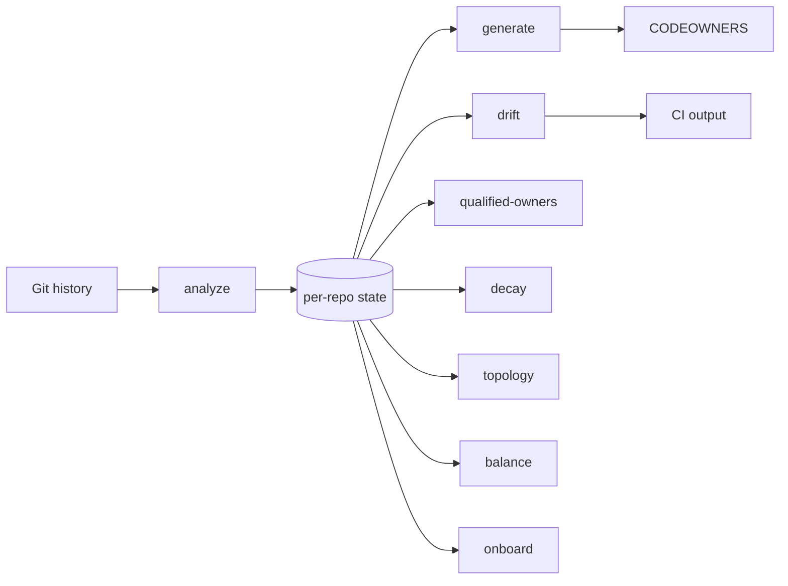
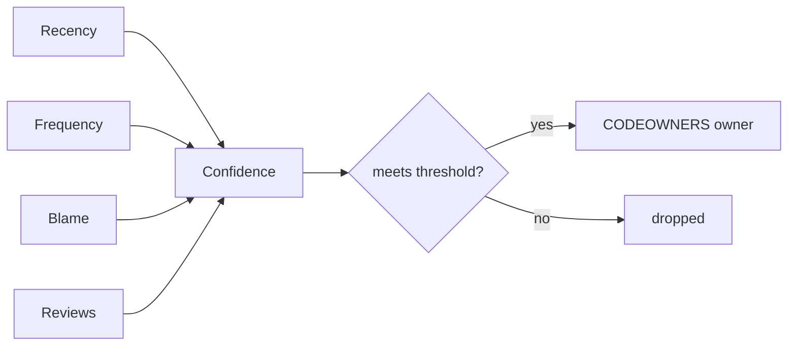

# Usage

Full configuration, scoring, and CI reference. For a quick command list see the [README](../README.md). For answers to common questions see [docs/FAQ.md](FAQ.md).

## Pipeline



State is cached per repo at `~/.checkowners/state/<repo-hash>.json` (override the base directory with `CHECKOWNERS_STATE_DIR`). `trends` is independent of the cached state: it runs its own `git log` pass to reconstruct per-period snapshots.

## Configuration

Create `.github/checkowners.yml`. Every field is optional; defaults shown.

```yaml
analysis:
  lookback_days: 365
  min_commits: 3
  top_n_owners: 3
  confidence_threshold: 0.3   # owners below this are dropped from CODEOWNERS
  exclude_bots: true          # drop dependabot[bot] & friends from inference

scoring:
  recency_half_life_days: 90  # exponential decay half-life
  recency_weight: 0.35
  frequency_weight: 0.25
  blame_weight: 0.25
  review_weight: 0.15         # only counted when github.api_enabled

decay:
  threshold_days: 180         # flag owners idle longer than this
  alert_on_decay: true

bus_factor:
  critical_threshold: 1
  warn_threshold: 2

paths:
  exclude:
    - "*.lock"
    - "package-lock.json"
    - "pnpm-lock.yaml"
    - "dist/**"
    - "vendor/**"
    - "node_modules/**"
    - "*.generated.*"
    - "*.min.js"
    - "*.min.css"
    - "*.map"
    - "*.whl"
    - ".github/CODEOWNERS"   # the generated file itself is never inferred
    - "CODEOWNERS"
    - "docs/CODEOWNERS"

output:
  header: "# Generated by checkOwners. Do not edit manually."
  include_unowned: false
  include_confidence: false   # if true, append "# alice(0.92) bob(0.71)" to each line
  consolidate: true           # collapse uniform directories into one dir/ rule

drift:
  mode: commit                # commit | repo | both
  min_confidence_delta: 0.2   # suppress small-delta drift

notifications:
  webhook_url: ""             # literal, or ${ENV_VAR} to read from the environment
  include_unchanged: false    # if true, also notify when no drift was detected
  severity_threshold: medium  # low | medium | high | critical

github:
  org: ""
  resolve_handles: true       # noreply emails parse locally; others via search API
  resolve_teams: true         # collapse owner sets to a @org/team when possible
  api_enabled: false          # gate review_weight + topology/balance API features
```

The GitHub token is **never** read from this file. Set the `GITHUB_TOKEN` environment variable instead. `checkowners.yml` is committed to your repo, so storing a token here would push it to GitHub. `load_config` raises a clear error if `github.token` is present. For the same reason, `notifications.webhook_url` supports a `${ENV_VAR}` reference (for example `${CHECKOWNERS_WEBHOOK_URL}`) so a committed config can point at a secret endpoint without storing it; an unset variable resolves to an empty string.

### Environment variables

| Variable | Who sets it | Role | Precedence |
|----------|-------------|------|------------|
| `CHECKOWNERS_CONFIG` | Action `config` input, or the user | Config file path (relative to repo root, or absolute) | Wins over `.github/checkowners.yml` |
| `CHECKOWNERS_DRIFT_MODE` | Action `mode` input, or the user | `commit` / `repo` / `both` | Applied after YAML load; wins over `drift.mode` |
| `CHECKOWNERS_STATE_DIR` | Action, or the user | State / handle / graph cache root | Wins over `~/.checkowners` |
| `GITHUB_TOKEN` | Action `github_token` input, or the user | Only supported token source | Never read from YAML (`github.token` is rejected) |
| `GITHUB_REPOSITORY` | GitHub runner | `owner/repo` for review coverage, topology, balance | Required for those API features; ignored otherwise |
| `GITHUB_OUTPUT` | GitHub runner | CLI may append step outputs when set | The Action unsets it on CLI steps (`env -u GITHUB_OUTPUT`) so the job-summary renderer owns the outputs |

The composite Action sets `CHECKOWNERS_STATE_DIR` to `${{ runner.temp }}/checkowners-state`. CLI and hand-rolled CI must set it themselves if they want an ephemeral cache.

## Identity resolution

Commit emails are rewritten to GitHub `@handles` in three stages, cheapest first:

1. **Noreply parsing** (no token, no network): `12345+login@users.noreply.github.com` and `login@users.noreply.github.com` become `@login`. On squash-merge repos this resolves most contributors for free.
2. **Disk cache** at `~/.checkowners/handles.json`, including remembered misses, so the search API is queried at most once per email.
3. **GitHub user-search API** (needs `GITHUB_TOKEN` and the `github` extra) for the rest.

When several emails resolve to the same handle they are merged into one owner: commits are summed and the path's qualified owner count is recomputed over distinct people.

## Confidence scoring

Each path-owner pair gets a confidence score in `[0.0, 1.0]` derived from four signals:

| Signal | Source | Weight (default) |
|--------|--------|------------------|
| Recency | `exp(-ln 2 × days_since_last_commit / half_life)` | 0.35 |
| Frequency | `commits / max_commits_for_path` | 0.25 |
| Blame coverage | `git blame --line-porcelain` lines / total lines | 0.25 |
| Review activity | PR reviews on the path (requires `github.api_enabled`) | 0.15 |



Weights are configurable under `scoring`. The final score is clamped to `[0.0, 1.0]`; owners below `analysis.confidence_threshold` are dropped from the generated CODEOWNERS. Qualified owner count per path is the count of remaining owners after that threshold and after `analysis.top_n_owners` truncation.

The blame pass only runs on paths where at least one author reaches `min_commits`, and runs on a thread pool sized to the CPU count. On the 0.5.0 dogfood run, a 24k-commit, 12k-file production monorepo completed a full 365-day analyze in under three minutes. That figure is one measurement, not a published reproducible harness.

## Qualified owner count

`qualified_owner_count` is the number of owners on a path whose confidence is at or above `analysis.confidence_threshold`, taken from the list that has already been truncated to `analysis.top_n_owners` (default 3). Human output always states the cap: `3 (capped by top_n_owners=3)`. JSON emits `qualified_owner_count`, `qualified_owner_count_cap`, and the deprecated `bus_factor` alias for one minor cycle.

This is not truck factor, bus factor, or lottery factor. Those metrics are a removal simulation over a knowledge distribution: the smallest set of contributors whose departure leaves a threshold fraction of files without an owner. CheckOwners does not compute knowledge shares, effective owner count, or TF50/75/90. Raising `top_n_owners` raises the maximum reportable count without any code changing hands. The `bus_factor:` config section still classifies this capped count (`critical` at or below `critical_threshold`, `warning` at or below `warn_threshold`).

`checkowners qualified-owners` is the canonical command. `checkowners bus-factor` remains as a deprecated alias; that name will be redefined.

## Generated CODEOWNERS

`checkowners generate` consolidates per-file inference into directory-level rules: when every inferred file under a directory shares the same owner set, one `/dir/ @owners` line replaces the per-file lines. That keeps the file reviewable and means brand-new files under the directory match a rule. Directories whose files disagree keep per-file lines. Set `output.consolidate: false` for raw per-file output.

`generate` and `sync` refuse to overwrite a CODEOWNERS that was not generated by CheckOwners (no machine-generated header). Pass `--force` to replace a hand-written file deliberately.

## Drift and severity

`checkowners drift` compares the inferred ownership against the existing CODEOWNERS and emits a JSON payload that downstream callers (CI, webhooks) can branch on.

The comparison uses real CODEOWNERS pattern semantics (gitignore-style: `*` within a segment, `**` across segments, leading `/` anchors to the repo root, trailing `/` matches directory contents, `dir/*` is direct children only, last matching rule wins), so directory and glob rules are honored:

| Category | Meaning |
|----------|---------|
| `missing` | An inferred file that no rule covers |
| `stale` | A rule whose pattern matches no tracked file (dead rule) |
| `changed` | A rule whose owners disagree with the inferred owners of files it covers, aggregated per rule and ranked by the worst per-file delta |

Owner comparison is case-insensitive, and owner-less rules (GitHub's exemption mechanism) count as intentional coverage. When comparison would be meaningless, drift emits a `note` instead of false positives: raw-email inference vs `@handle` rules (set `GITHUB_TOKEN` to resolve handles), and rules owned by `@org/team` (individual inference cannot be compared to a team).

`notify.compute_severity` maps the max confidence delta plus qualified-owner / decay flags to a tier:

| Severity | Trigger |
|----------|---------|
| `critical` | Any drift entry at or below `bus_factor.critical_threshold` (applied to `qualified_owner_count`), or `decay = true` |
| `high` | `max_confidence_delta >= 0.7` |
| `medium` | `max_confidence_delta >= 0.3` |
| `low` | otherwise |

`notifications.severity_threshold` decides when a webhook fires, and `--json` always includes the `severity` field so CI workflows can branch on it. Webhook failures never crash the CLI; `notify` reports `sent: false` and logs the reason. Runs without drift skip the webhook unless `include_unchanged: true`.

## GitHub Actions

Least privilege (job summary only; no PR comment):

```yaml
name: checkowners
on: [pull_request]

jobs:
  drift:
    runs-on: ubuntu-latest
    permissions:
      contents: read
    steps:
      - uses: actions/checkout@v4
        with:
          fetch-depth: 0
      - uses: smusali/checkowners@v0
        with:
          config: .github/checkowners.yml
          comment_on_pr: false
```

Same-repo PR comments (`comment_on_pr` defaults to `"true"`):

```yaml
name: checkowners
on: [pull_request]

jobs:
  drift:
    runs-on: ubuntu-latest
    permissions:
      contents: read
      pull-requests: write
    steps:
      - uses: actions/checkout@v4
        with:
          fetch-depth: 0
      - uses: smusali/checkowners@v0
        with:
          config: .github/checkowners.yml
```

`@v0` tracks the latest 0.x release. `@v0.5` tracks 0.5.x patches. `@v0.5.1` is the immutable pin for this release.

The action always writes the full report to the job summary. That needs no extra permissions and works on fork pull requests, where the job token is read-only regardless of the `permissions:` block. On a fork pull request the action skips commenting, emits a notice, and leaves the job green.

If `comment_on_pr` stays `"true"` under read-only workflow permissions, the comment step warns (`Grant 'pull-requests: write' or set comment_on_pr: false`) and does not fail the job. Set `comment_on_pr: false` to skip the attempt.

The composite action writes bounded JSON summaries to `GITHUB_OUTPUT` (`schema_version: 2`) so workflow gates stay under GitHub's 1 MB per-output cap. Existing `fromJson(...)` checks keep working: `checkowners_drift.drift_detected`, `checkowners_drift.severity`, and `bus_factor_summary.critical_paths[0]`. Each summary includes `counts` and `truncated`. The qualified-owner summary also includes `qualified_owner_count_cap` and `deprecated_keys`. Drift still carries `notes` plus the top `missing` / `stale` / `changed` entries (with per-entry `qualified_owner_count` / deprecated `bus_factor` / `decay` flags). Per-path `entries` are omitted from the output; the full lists live in the uploaded artifact.

Set `max_output_entries` (default `50`) to cap each list in those summaries and in the job-summary / PR-comment report. Workflows that need every entry should `actions/download-artifact` using the `artifact_name` output (`checkowners-reports`) and branch on `schema_version`.

The composite action exports `GITHUB_TOKEN` on every CLI step from the `github_token` input, which defaults to `${{ github.token }}`, and passes the same token to the PR comment step. Most callers can omit the input. Override it with a PAT or App token when the default job token cannot list org teams or cannot comment. A supplied token takes precedence over `github.token`. Minimum permissions for each capability are listed in [docs/FAQ.md](FAQ.md#what-token-scopes-are-needed).

The composite action also accepts `fail_on_drift: "false"` if you want to report without blocking, `include_bus_factor` / `include_decay` toggles for the secondary outputs, `max_output_entries` for summary size, and `comment_on_pr` (default `"true"`) which maintains a single drift + qualified-owners summary comment on same-repo pull requests, updated in place on every push and marked resolved when drift clears. The Action output key remains `bus_factor_summary` for compatibility.

The action fails fast with a clear error when it detects a shallow clone: `git log` and `git blame` need history, so the `actions/checkout` step must set `fetch-depth: 0`.

With no extra inputs, Action `vX.Y.Z` installs `checkowners==X.Y.Z` from the wheel committed next to `action.yml`, and installs third-party dependencies from `requirements.lock` with `pip install --require-hashes --only-binary :all:`. An empty `checkowners_version` uses that pin; it never installs "whatever PyPI serves today." After install, the action asserts `checkowners --version` matches the pin.

Advanced install inputs:

| Input | Default | Purpose |
|-------|---------|---------|
| `checkowners_version` | this Action's tag version | Override to install a different published version from the index. That path still uses the hashed lockfile for third-party deps, but skips hash verification for the `checkowners` package itself. |
| `index_url` | (PyPI) | pip `--index-url` for an internal mirror. |
| `offline` | `"false"` | Install the committed wheel with `--no-index --find-links`. The override must match the pin. A fully air-gapped runner also needs the lockfile wheels on disk (`pip download --require-hashes -r requirements.lock -d <dir>`) or a reachable `index_url`. |
| `install_spec` | `""` | **Security-sensitive.** Allowed only as a local extras spec for dogfooding this repository: `.`, `.[graph]`, `.[github]`, `.[graph,github]`, `.[github,graph]`, or `.[all]`. Interpolating untrusted workflow data into this input is remote code execution. Downstream callers must omit it. |

## How checkowners compares

CheckOwners treats code ownership as a confidence-scored spectrum rather than a static binary declaration. No other open-source tool combines git-history inference, calibrated per-path confidence, pattern-aware drift with severity tiers, and knowledge-risk reporting behind a single CI-native JSON contract. Individual pieces exist elsewhere; the table credits them.

| Tool | Infers from history | Confidence score | Drift detection | Owner validity | Knowledge risk | Forges |
|---|---|---|---|---|---|---|
| **checkowners** | yes | yes, four-factor | yes, pattern-aware with severity | syntax and handle format | qualified-owner depth, decay, topology, balance | GitHub |
| History-based generator | **yes** | no, threshold only | no | no | no | git |
| Monorepo CODEOWNERS compiler | no, composes files | no | **yes, `check` mode** | no | no | GitHub |
| Dedicated CODEOWNERS validator | no | no | partial: not-owned plus file-exist | **yes: verifies accounts, org membership, teams** | no | GitHub |
| Ownership-audit CLI | no | no | no | no | ownership stats only | GitHub |
| GitHub-endpoint linter | no | no | no | **yes, via GitHub's own endpoint** | no | GitHub |
| Bus/truck-factor research tooling | yes | knowledge model | no | no | **yes, formal bus/truck factor** | GitHub / git |
| GitHub native | no | no | no | partial, UI errors | no | GitHub |

Representative tools, so the credits are reviewable: [tomasbjerre/generate-codeowners](https://github.com/tomasbjerre/generate-codeowners) (`--since`, `--minimumcommitcount`, `--maximumnumberofcommitters`, `--identifier`); [gagoar/codeowners-generator](https://github.com/gagoar/codeowners-generator) (compose plus `--check`); [mszostok/codeowners-validator](https://github.com/mszostok/codeowners-validator) (`files`, `notowned`, and `owners` checks that verify accounts, org membership, and teams); [snyk/github-codeowners](https://github.com/snyk/github-codeowners) (`audit -s` coverage stats); [heaths/gh-codeowners](https://github.com/heaths/gh-codeowners) wrapping `GET /repos/{owner}/{repo}/codeowners/errors`; [aserg-ufmg/Truck-Factor](https://github.com/aserg-ufmg/Truck-Factor) (Avelino et al., ICPC 2016; degree-of-authorship plus removal simulation); GitHub CODEOWNERS UI and branch protection.

### Competitive positioning

- **GitHub CODEOWNERS.** Native, trusted, and wired into review enforcement. Static declaration; infers nothing. CheckOwners is the intelligence and reconciliation layer above it.
- **Dedicated validators.** Account, org, and team checks that CheckOwners `validate` does not do. Use a validator for integrity; use CheckOwners for observed-versus-declared drift.
- **Generators and compilers.** Distributed declarations and a compile/`check` mode that fails CI when the composed file is stale. CheckOwners infers from history; it does not compose satellite CODEOWNERS files.
- **Ownership-audit CLIs.** Coverage stats over the committed file (owned vs unowned, per-owner counts). CheckOwners scores inferred expertise and knowledge risk.
- **Bus/truck-factor research tools.** Formal removal simulation over a knowledge distribution. CheckOwners reports a capped `qualified_owner_count` plus decay, topology, and balance. Those are not the same metric; see [Qualified owner count](#qualified-owner-count).
- **Commercial behavioral analysis.** Mature framing around knowledge distribution, key-person risk, and team/code alignment. CheckOwners is the local-first open-source ownership-intelligence layer, not a commercial suite clone.

## Development

See [docs/CONTRIBUTING.md](CONTRIBUTING.md) for the full contributor guide. Common commands:

```bash
hatch run test              # pytest with coverage; fails below 85%
hatch run lint              # ruff check + mypy --strict
hatch run fmt               # ruff format
hatch build                 # sdist + wheel in dist/
```
